**Phishing Email Campaign: Investigation Walkthrough**

# 1. Initial Triage

1.  Open the forwarded email in a safe text editor rather than a mail
    client, to avoid triggering any hidden tracking pixels.

2.  Read the report: employee James Holt (james.holt@cloudora.io)
    forwarded a message to soc@cloudora.io because it threatened to
    withhold his salary unless he clicked a payroll link by 5:00 PM, an
    urgency/fear pretext that\'s a classic phishing pressure tactic.

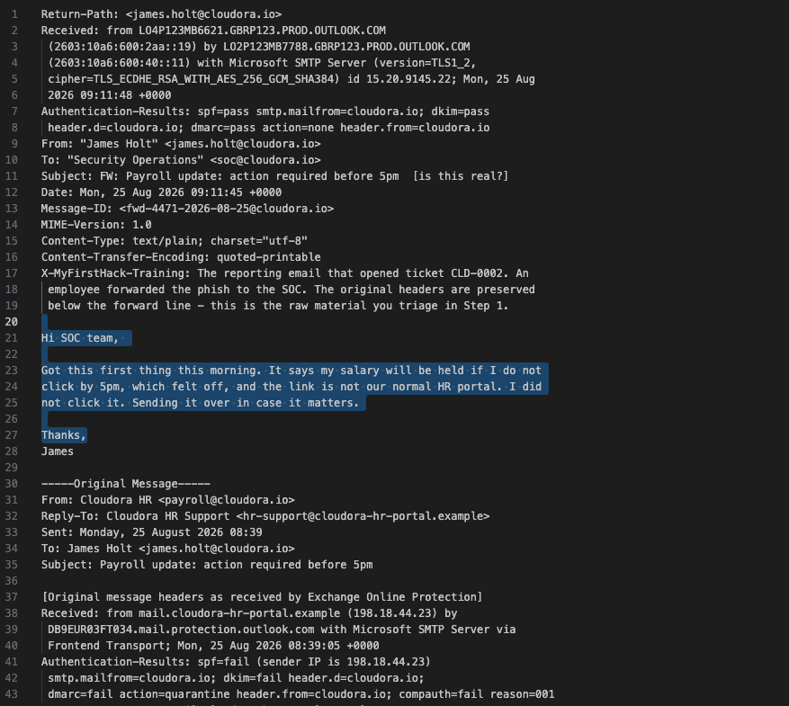

# 2. Header Analysis

Digging into the original headers preserved below the forward line:

-   Authentication-Results: spf=fail, dkim=fail, dmarc=fail, the sending
    IP was never authorized to send as cloudora.io.

-   Received: from mail.cloudora-hr-portal.example (198.18.44.23), a
    relay that is not a legitimate Cloudora or Microsoft 365 server.

-   From: "Cloudora HR" \<payroll@cloudora.io\> (spoofed), but Reply-To:
    "Cloudora HR Support" \<hr-support@cloudora-hr-portal.example\>,
    which routes replies straight to the attacker\'s lookalike domain.

  ----------------------------------------------------------------------- ----------
  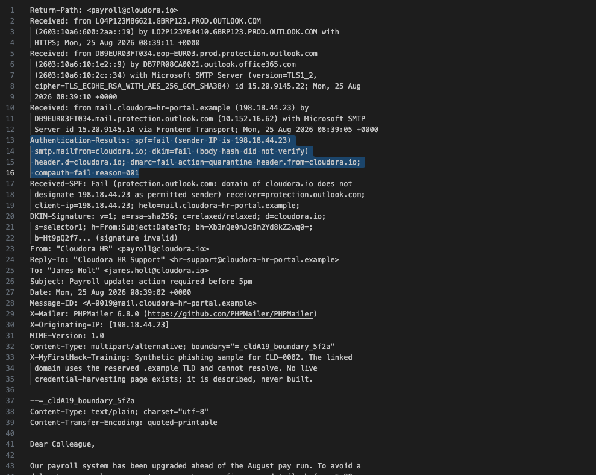                                         

  ----------------------------------------------------------------------- ----------

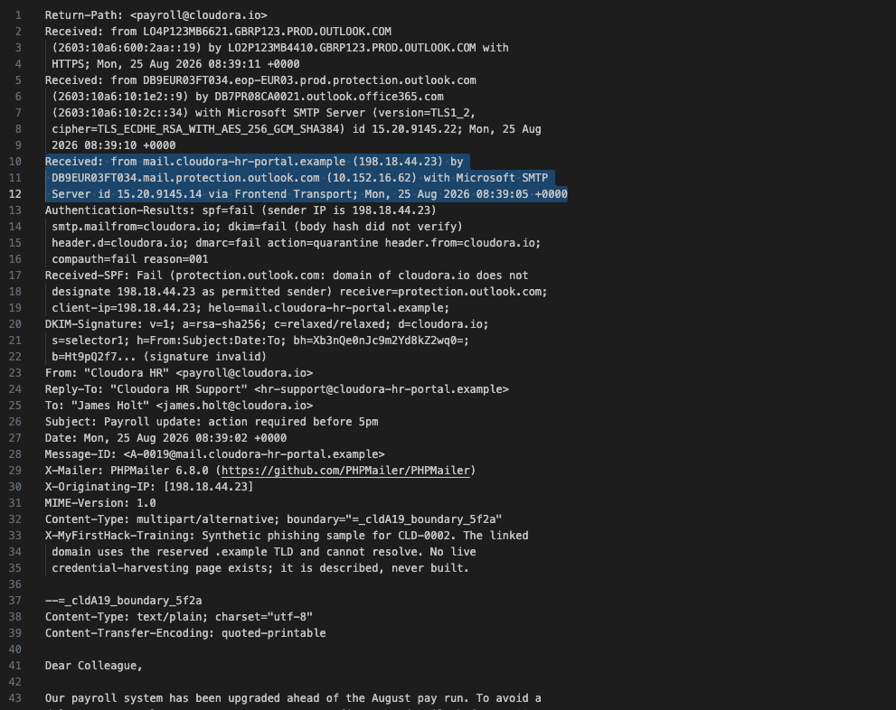

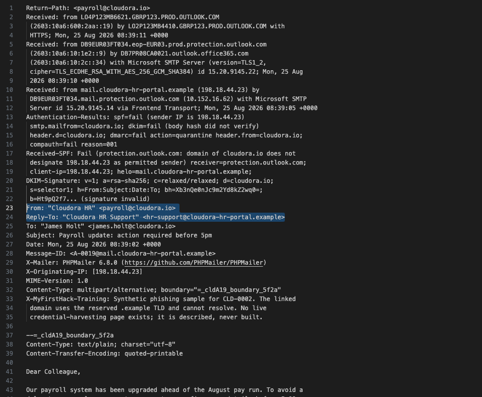

The message body contains a credential-harvesting link to the lookalike
domain. For safe documentation, it\'s defanged as:

hxxps://cloudora-hr-portal\[.\]example/payroll/login

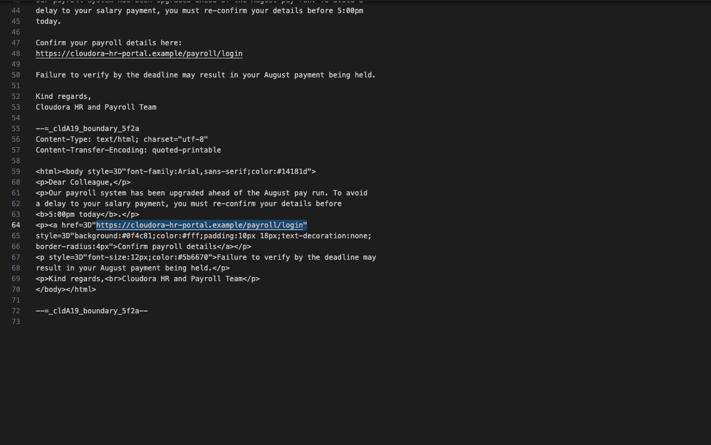

# 3. Mapping the Campaign Infrastructure

Comparing the reported message against a second sample recovered from
another mailbox shows the attacker ran two variants:

  ------------- ---------------- ---------------- ---------------------------- ----------------
  **Variant**   **Sending IP**   **Auth result**  **From / Reply-To domain**   **Notes**

  A             198.18.44.10,    SPF/DKIM/DMARC   cloudora.io (spoofed)        Two IPs in the
                198.18.44.23     fail                                          same /24 -
                                                                               outright domain
                                                                               spoof, easy to
                                                                               catch

  B             198.18.51.7      SPF/DKIM/DMARC   cloudora-hr-portal.example   Fully
                                 pass             (attacker-owned lookalike)   authenticated
                                                                               because the
                                                                               attacker owns
                                                                               the sending
                                                                               domain - much
                                                                               harder for
                                                                               filters to catch
  ------------- ---------------- ---------------- ---------------------------- ----------------

In total: 3 sending IPs and 1 attacker-registered lookalike domain
across both variants.

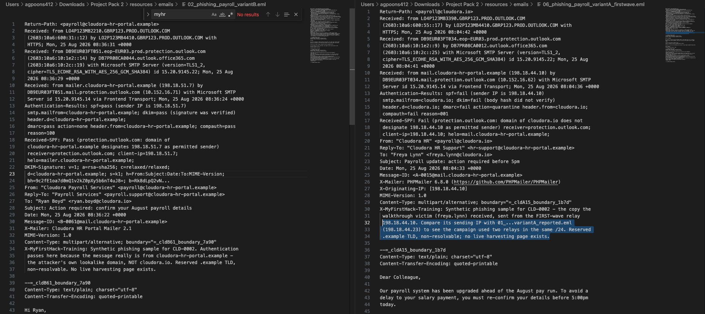

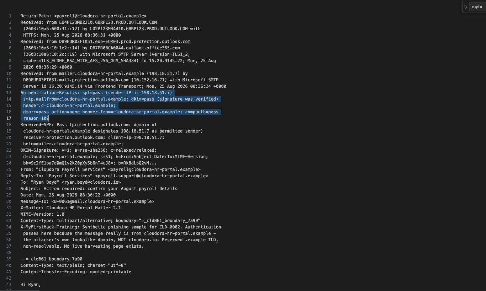

# 4. Threat Intelligence Enrichment

-   VirusTotal: cloudora-hr-portal.example is flagged malicious by 9 of
    94 vendors, tagged phishing / credential-harvesting /
    newly-registered / impersonation. Registered 2026-08-20, only 5 days
    before the campaign. It resolves to both Variant A relay IPs
    (198.18.44.10 and 198.18.44.23), and its mail server IP is
    198.18.51.7, the same IP that sent Variant B.

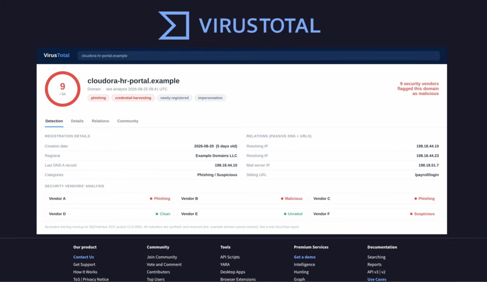

-   AbuseIPDB: IP 198.18.44.10 has a 100% abuse-confidence score from 37
    reports (12 distinct reporters), hosted by "Example Hosting B.V."
    (ASN AS64500) in Amsterdam, Netherlands, flagged for phishing, email
    spam, brute-force, and web-app attacks, with a report as recent as
    the campaign date citing the exact cloudora-hr-portal\[.\]example
    harvesting link.

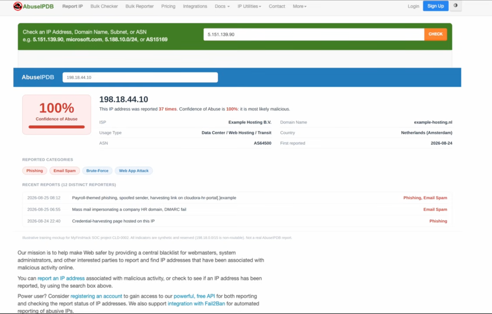

# 5. Ruling Out a False Positive

A legitimate Cloudora newsletter was checked for comparison, to make
sure it isn\'t part of the campaign:

-   SPF pass (sender IP 198.18.60.5), DKIM pass, DMARC pass, signed by
    both cloudora.io and its authorized email vendor, mcsv.net
    (Mailchimp).

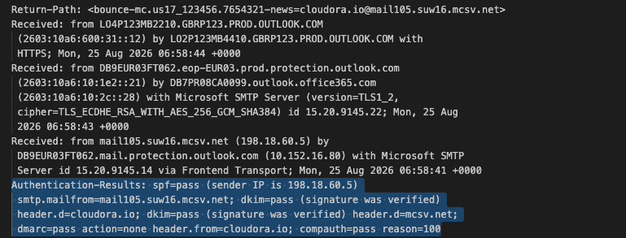
-   Standard one-click List-Unsubscribe headers are present, consistent
    with legitimate bulk marketing mail.

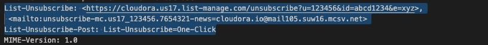

-   From and Reply-To both legitimately read "Cloudora News"
    \<news@cloudora.io\>, no domain mismatch.

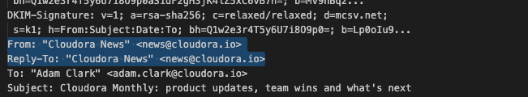

Conclusion: this newsletter is authentic and unrelated to the phishing
campaign.

# 6. Log Ingestion for Analysis (Microsoft Sentinel / Azure Data Explorer)

1.  Import the CloudoraSignIn_CL dataset (Entra ID sign-in logs) into
    the MyFreeCluster/Cloudora workspace to prepare authentication
    records for analysis.

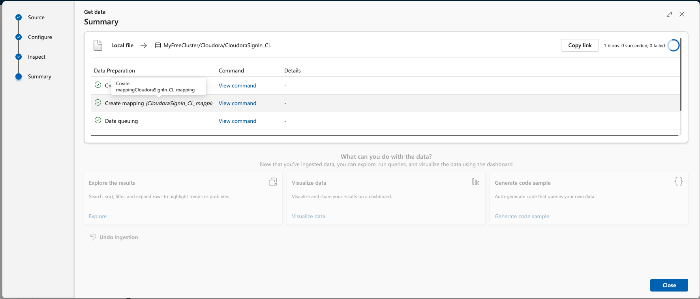

2.  Select CloudoraMsgTrace_CL as the destination table for the email
    delivery and interaction (click) logs.

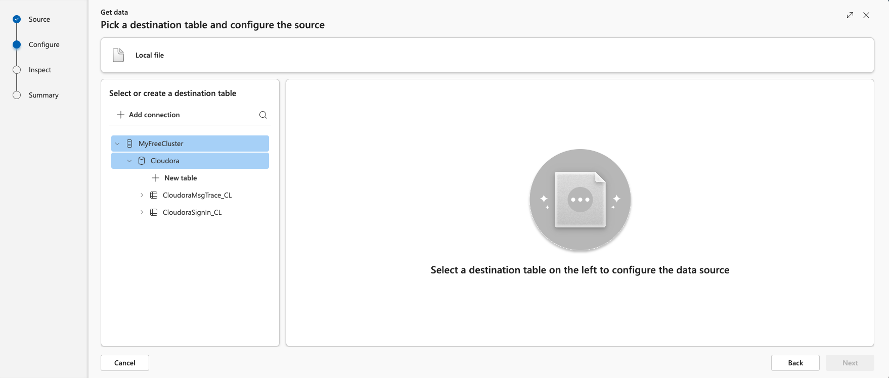

3.  Run a count query to confirm ingestion.

  ------------------------------------------------------------------------- -------------------------------------------------------------------------
    
  ------------------------------------------------------------------------- -------------------------------------------------------------------------

# 7. Delivery and Click Analysis

Querying CloudoraMsgTrace_CL by campaign, sender IP, and authentication
result breaks delivery down as follows:

So filtering caught some of the outright-spoofed Variant A traffic (7 of
40 messages quarantined), but every single fully-authenticated Variant B
message, the more dangerous one, reached an inbox.

## Who clicked

Querying click events shows 6 employees clicked the link; 2 went on to
submit credentials:

# 8. Confirming Account Compromise via Sign-In Logs

Pulling Entra ID sign-in records for the two credential victims
(freya.lynn and ryan.boyd), filtered to successful sign-ins (ResultType
== \"0\"):

Both users\' own devices (iOS/Mobile Safari, from their normal UK
cities) bracket a block of sign-ins from Windows 11/Chrome at IP
198.18.7.200 in Amsterdam, physically impossible given the timing, and
there are no failed attempts in between, meaning the attacker
authenticated with a correct password rather than guessing one. During
that window the attacker\'s session touched Microsoft 365, Outlook Web
App, and (for Freya) SharePoint Online.

Pivoting on the attacker\'s IP range confirms it acted on both accounts:

