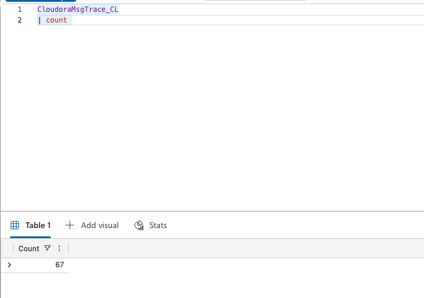
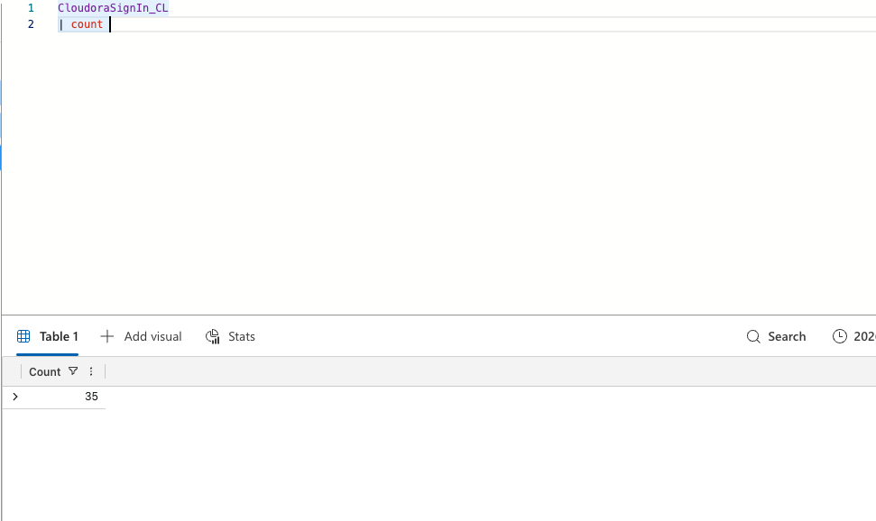
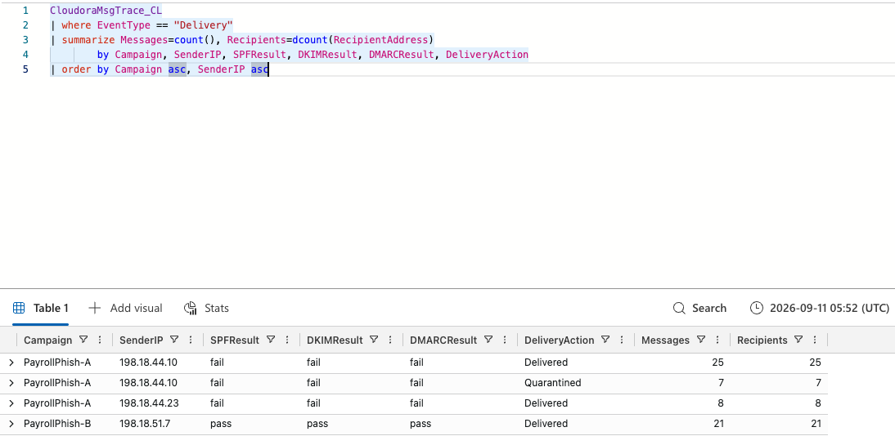
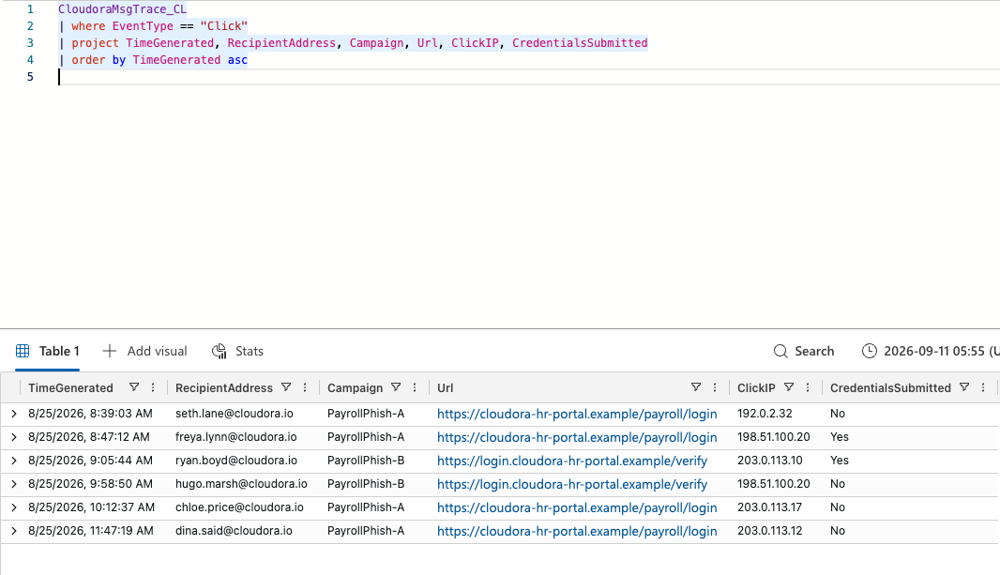
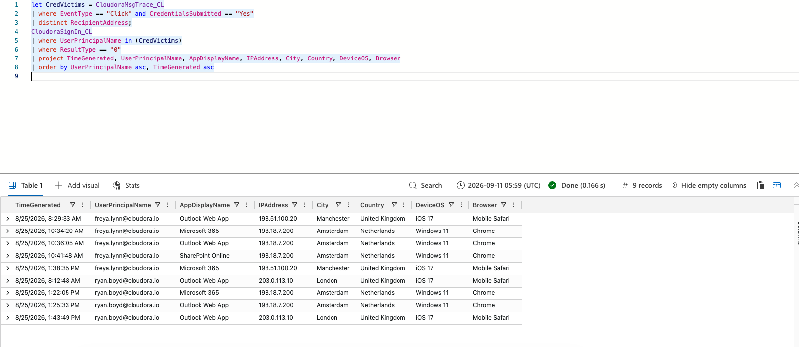
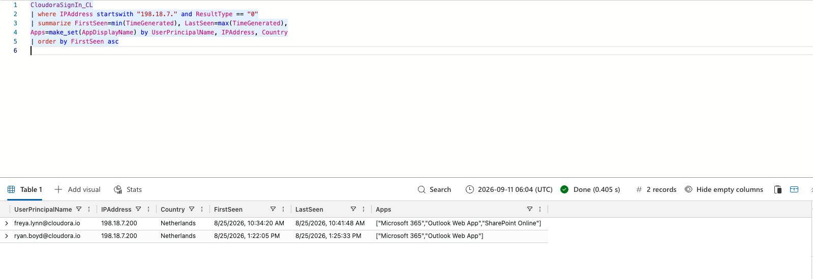

# KQL Query Reference — Cloudora Payroll Phishing Investigation

All queries below were run in Microsoft Sentinel / Azure Data Explorer against the two custom
tables ingested for this investigation: `CloudoraMsgTrace_CL` (email delivery + click telemetry)
and `CloudoraSignIn_CL` (Entra ID sign-in logs). They're listed in the order they were run during
the walkthrough, each with the result it returned and what it proved.

---

## 1. Confirm message trace ingestion

```kql
CloudoraMsgTrace_CL
| count
```

**Result:** `67` records loaded.



---

## 2. Confirm sign-in log ingestion

```kql
CloudoraSignIn_CL
| count
```

**Result:** `35` records loaded.



---

## 3. Delivery outcome by campaign / sender IP / auth result

```kql
CloudoraMsgTrace_CL
| where EventType == "Delivery"
| summarize Messages=count(), Recipients=dcount(RecipientAddress)
    by Campaign, SenderIP, SPFResult, DKIMResult, DMARCResult, DeliveryAction
| order by Campaign asc, SenderIP asc
```

**Result:**

| Campaign | SenderIP | SPF | DKIM | DMARC | DeliveryAction | Messages | Recipients |
|---|---|---|---|---|---|---|---|
| PayrollPhish-A | 198.18.44.10 | fail | fail | fail | Delivered | 25 | 25 |
| PayrollPhish-A | 198.18.44.10 | fail | fail | fail | Quarantined | 7 | 7 |
| PayrollPhish-A | 198.18.44.23 | fail | fail | fail | Delivered | 8 | 8 |
| PayrollPhish-B | 198.18.51.7 | pass | pass | pass | Delivered | 21 | 21 |

**What it proved:** Exchange Online Protection caught 7 of 40 outright-spoofed Variant A
messages, but *every* fully-authenticated Variant B message reached an inbox — the
lookalike-domain variant was the more dangerous one precisely because it passed authentication.



---

## 4. Who clicked the phishing link

```kql
CloudoraMsgTrace_CL
| where EventType == "Click"
| project TimeGenerated, RecipientAddress, Campaign, Url, ClickIP, CredentialsSubmitted
| order by TimeGenerated asc
```

**Result:** 6 employees clicked; 2 submitted credentials.

| Time | Recipient | Campaign | ClickIP | CredentialsSubmitted |
|---|---|---|---|---|
| 8:39:03 AM | seth.lane@cloudora.io | PayrollPhish-A | 192.0.2.32 | No |
| 8:47:12 AM | freya.lynn@cloudora.io | PayrollPhish-A | 198.51.100.20 | **Yes** |
| 9:05:44 AM | ryan.boyd@cloudora.io | PayrollPhish-B | 203.0.113.10 | **Yes** |
| 9:58:50 AM | hugo.marsh@cloudora.io | PayrollPhish-B | 198.51.100.20 | No |
| 10:12:37 AM | chloe.price@cloudora.io | PayrollPhish-A | 203.0.113.17 | No |
| 11:47:19 AM | dina.said@cloudora.io | PayrollPhish-A | 203.0.113.12 | No |



---

## 5. Sign-in activity for the two credential victims

```kql
let CredVictims = CloudoraMsgTrace_CL
    | where EventType == "Click" and CredentialsSubmitted == "Yes"
    | distinct RecipientAddress;
CloudoraSignIn_CL
| where UserPrincipalName in (CredVictims)
| where ResultType == "0"
| project TimeGenerated, UserPrincipalName, AppDisplayName, IPAddress, City, Country, DeviceOS, Browser
| order by UserPrincipalName asc, TimeGenerated asc
```

**Result:** Both victims' legitimate iOS/Mobile Safari sign-ins from their normal UK cities are
bracketed by a block of Windows 11/Chrome sign-ins from **198.18.7.200 (Amsterdam, NL)** — an
impossible-travel pattern with no failed attempts in between, meaning the attacker authenticated
with a correct, harvested password rather than guessing one.



---

## 6. Pivot on the attacker's IP to confirm scope

```kql
CloudoraSignIn_CL
| where IPAddress startswith "198.18.7." and ResultType == "0"
| summarize FirstSeen=min(TimeGenerated), LastSeen=max(TimeGenerated),
    Apps=make_set(AppDisplayName) by UserPrincipalName, IPAddress, Country
| order by FirstSeen asc
```

**Result:**

| UserPrincipalName | IPAddress | Country | FirstSeen | LastSeen | Apps |
|---|---|---|---|---|---|
| freya.lynn@cloudora.io | 198.18.7.200 | Netherlands | 10:34:20 AM | 10:41:48 AM | Microsoft 365, Outlook Web App, SharePoint Online |
| ryan.boyd@cloudora.io | 198.18.7.200 | Netherlands | 1:22:05 PM | 1:25:33 PM | Microsoft 365, Outlook Web App |

**What it proved:** confirms the same attacker IP acted on *both* compromised accounts, closing
out the scope of the intrusion.



---

### Tables referenced
- **`CloudoraMsgTrace_CL`** — email delivery + click/interaction log (`EventType`, `Campaign`,
  `SenderIP`, `SPFResult`/`DKIMResult`/`DMARCResult`, `DeliveryAction`, `RecipientAddress`, `Url`,
  `ClickIP`, `CredentialsSubmitted`)
- **`CloudoraSignIn_CL`** — Entra ID sign-in log (`UserPrincipalName`, `ResultType`, `AppDisplayName`,
  `IPAddress`, `City`, `Country`, `DeviceOS`, `Browser`)
